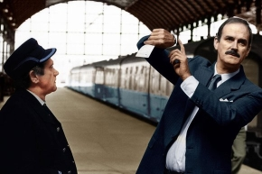

:mod:`clockwise` module
-----------------------

right! date and time.
            (module name after the movie clockwise, starring monthy python john cleese)

.. autoclass:: teafiles.clockwise.DateTime
    :members: parse, ticks, date, totimeandms
    :undoc-members:
    :show-inheritance:

Supported operations:

+-----------------------------------------------+----------------------------------------------------------+
| Operation                                     | Result                                                   |
+===============================================+==========================================================+
| ``t1 == t2``                                  | t1.ticks == t2.ticks                                     |
+-----------------------------------------------+----------------------------------------------------------+
| ``t1 != t2``                                  | t1.ticks != t2.ticks                                     |
+-----------------------------------------------+----------------------------------------------------------+
| ``t1 >  t2``                                  | t1.ticks > t2.ticks                                      |
+-----------------------------------------------+----------------------------------------------------------+
| ``t1 >= t2``                                  | t1.ticks >= t2.ticks                                     |
+-----------------------------------------------+----------------------------------------------------------+
| ``t1 <  t2``                                  | t1.ticks <  t2.ticks                                     |
+-----------------------------------------------+----------------------------------------------------------+
| ``t1 <= t2``                                  | t1.ticks <= t2.ticks                                     |
+-----------------------------------------------+----------------------------------------------------------+
| ``d2 = d1 +  duration``                       | adds duration, returning a new DateTime                  |
+-----------------------------------------------+----------------------------------------------------------+
| ``t += Duration``                             | adds duration to t assigning new DateTime to t           |
+-----------------------------------------------+----------------------------------------------------------+
| ``int(DateTime)``                             | returns ticks                                            |
+-----------------------------------------------+----------------------------------------------------------+
| ``math.trunc(DateTime)``                      | returns itself                                           |
+-----------------------------------------------+----------------------------------------------------------+

.. autoclass:: teafiles.clockwise.Duration
    :members: ticks, totimedelta
    :undoc-members:
    :show-inheritance:

Supported Operations:

+-----------------------------------------------+--------------------------------------------------+
| Operation                                     | Result                                           |
+===============================================+==================================================+
| ``d1 == d2``                                  | d1.ticks == d2.ticks                             |
+-----------------------------------------------+--------------------------------------------------+
| ``d1 != d2``                                  | d1.ticks != d2.ticks                             |
+-----------------------------------------------+--------------------------------------------------+
| ``d1 >  d2``                                  | d1.ticks > d2.ticks                              |
+-----------------------------------------------+--------------------------------------------------+
| ``d1 >= d2``                                  | d1.ticks >= d2.ticks                             |
+-----------------------------------------------+--------------------------------------------------+
| ``d1 <  d2``                                  | d1.ticks <  d2.ticks                             |
+-----------------------------------------------+--------------------------------------------------+
| ``d1 <= d2``                                  | d1.ticks <= d2.ticks                             |
+-----------------------------------------------+--------------------------------------------------+
| ``d = d1 + 2``                                | adds both durations, returning new Duration      |
+-----------------------------------------------+--------------------------------------------------+
| ``d += d2``                                   | adds d2 to d, assigning new Duration to d        |
+-----------------------------------------------+--------------------------------------------------+
| ``int(Duration)``                             | returns ticks                                    |
+-----------------------------------------------+--------------------------------------------------+
| ``math.trunc(Duration)``                      | returns itself                                   |
+-----------------------------------------------+--------------------------------------------------+

Utility functions
=================

.. autofunction:: teafiles.clockwise.range(*args)
.. autofunction:: teafiles.clockwise.rangen(startdate, stepduration, count)
.. autofunction:: teafiles.clockwise.isdatetime(value)
.. autofunction:: teafiles.clockwise.isduration(value)
